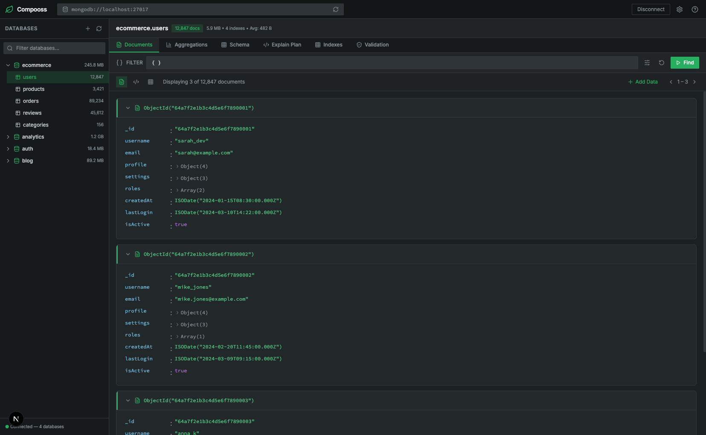

# Compooss

Compooss is a lightweight MongoDB database client designed to run **inside your `docker-compose` stack** during development. The goal is to give you an easy way to explore and manage your MongoDB data **without installing a separate GUI app** on your machine.



### Features (planned)

- **Docker-first**: Run as a service alongside your app in `docker-compose`.
- **No local install**: Access the UI from your browser, no native app required.
- **MongoDB focused**: Simple workflows for browsing databases, collections, and documents.
- **Dev-friendly**: Optimized for local development environments and throwaway stacks.

### Example `docker-compose` usage (conceptual)

```yaml
services:
  mongo:
    image: mongo:latest
    ports:
      - "27017:27017"

  compooss:
    image: compooss/app:latest
    environment:
      - MONGO_URI=mongodb://mongo:27017
    ports:
      - "8080:80"
    depends_on:
      - mongo
```

Then open `http://localhost:8080` in your browser to access Compooss.

### Development

This repository contains the source code for Compooss. During early development, setup and usage may change frequently.

Basic local flow (subject to change):

```sh
git clone <REPO_URL>
cd compass-companion
npm install
npm run dev
```

### Roadmap

- **MVP**: Basic connection to MongoDB, list databases and collections, view documents.
- **Improved UX**: Filters, pagination, and simple query builder.
- **Write operations**: Insert, update, and delete documents with safeguards.
- **Auth & security**: Configurable access controls for shared dev environments.

### Author

- **Name**: Abdullah  
- **Project**: Compooss – MongoDB client for `docker-compose`-based development

### License

This project is licensed under the **MIT License**. You are free to use, modify, and distribute this software, subject to the terms of the MIT License.
