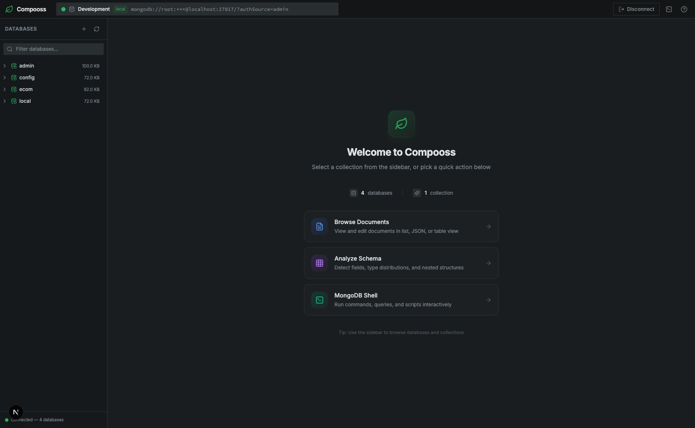

# Compooss

Compooss is a lightweight, self‑hosted MongoDB GUI that runs **inside your Docker stack**.

It is designed for local and team development environments where you already use `docker-compose` and want a fast, visual way to explore and manage MongoDB — **without installing a desktop app or signing up for any cloud service**.

**Current release: v1.7.0 – Multiple Connections.**



---

## Core Features

- **Docker‑native deployment**
  - Ships as a single Docker image you can drop into any `docker-compose.yml`.
  - No Node.js, MongoDB tools, or extra services required on your host.

- **Database & collection explorer**
  - Browse all databases and collections from a sidebar.
  - View document counts, storage stats, index counts, and more at a glance.

- **Document browsing & CRUD**
  - Query with native MongoDB filter syntax.
  - Sort, paginate, and inspect documents in **list, JSON, or table** views.
  - Create, edit, and delete documents using a Monaco‑powered JSON editor with validation and syntax highlighting.

- **Index management**
  - Create, drop, hide/unhide, and inspect indexes.
  - Supports unique, compound, text, geospatial, TTL, partial, and hashed indexes.
  - View index usage statistics directly in the UI.

- **Schema analysis**
  - Sample documents to infer schema per collection.
  - Inspect detected fields, types, frequency, distributions, nested structures, and missing / inconsistent fields.
  - Refresh analysis on demand.

- **Aggregation pipelines**
  - Visual aggregation builder with stage templates.
  - Drag‑and‑drop stages, enable/disable, and preview results per stage.
  - Text mode editing, saved pipelines, and “create view from pipeline”.

- **Embedded MongoDB shell**
  - Browser‑based shell panel that talks directly to your MongoDB deployment.
  - Run CRUD, aggregation, admin commands, and JavaScript queries.
  - Autocomplete, syntax highlighting, history, and session persistence.

- **Multiple connections (v1.7.0)**
  - Dedicated `/connect` page to create and manage connection profiles.
  - Save, edit, favorite, and color‑code connections.
  - Test a connection before connecting; invalid URIs stay on `/connect` with inline errors.
  - Supports advanced options and future authentication/TLS profiles.

- **Safety for development**
  - System databases (`admin`, `local`, `config`) are treated as read‑only in the UI.
  - Guard rails around destructive operations to reduce “oops” moments in dev.

For a detailed feature breakdown and screenshots, see [`docs/FEATURES.md`](docs/FEATURES.md) and the docs app under `apps/docs`.

---

## Quick Start

### 1. Docker Compose (recommended)

Add Compooss next to your MongoDB service:

```yaml
services:
  mongo:
    image: mongo:7
    ports:
      - "27017:27017"

  compooss:
    image: abdullahmia/compooss:latest
    ports:
      - "3000:3000"
    depends_on:
      - mongo
```

Then open:

- `http://localhost:3000` → Compooss UI

### 2. Docker Run

Connect Compooss to a MongoDB instance on your host:

```bash
docker run -p 3000:3000 abdullahmia/compooss:latest
```

Then open `http://localhost:3000` in your browser.

---

## Configuration

Supported environment variables:

- `PORT`
  - Port the HTTP server listens on inside the container.
  - Default: `3000`.

---

## Development Setup

This repository is a monorepo (Next.js app + docs + shared packages). Basic local flow:

```bash
git clone https://github.com/abdullahmia/compooss.git
cd compooss
npm install

# Start the main app (MongoDB GUI)
npm run dev:app

# Optionally: start the docs site
npm run dev:docs
```

Then open:

- `http://localhost:3000` → Compooss app
- `http://localhost:3001` (or whatever port your docs dev script uses) → docs/landing page

> Check the scripts in `apps/compooss/package.json` and `apps/docs/package.json` for the exact dev commands used in this repo.

---

## Release Roadmap (shipped & planned)

- **v1.0.0 (MVP)** – Connection, database/collection list & CRUD, document view & CRUD, Docker image.
- **v1.1.0** – Loading skeletons, better error handling and loading states.
- **v1.2.0** – Full index management: create, drop, hide/unhide; usage stats; all major index types.
- **v1.3.0** – Schema analysis: sampled schema view with types, frequency, distributions, nested structures.
- **v1.5.0** – Aggregation pipelines: visual pipeline builder, stage templates, previews, saved pipelines, view creation.
- **v1.6.0** – MongoDB Shell: embedded shell with autocomplete, history, syntax highlighting, CRUD/aggregation/admin helpers.
- **v1.7.0** – Multiple connections: saved profiles, favorites, colors, dedicated `/connect` page, disconnect/reconnect from top bar.
- **Planned** – Theming (system/dark/light), richer query tooling & UX, optional auth for shared dev environments, more deploy recipes.

For a living roadmap, see [`docs/FEATURES.md`](docs/FEATURES.md) and [`docs/CHANGELOG.md`](docs/CHANGELOG.md).

---

## Documentation

- [`docs/FEATURES.md`](docs/FEATURES.md) – Feature list & roadmap.
- [`docs/CHANGELOG.md`](docs/CHANGELOG.md) – Version history.
- [`docs/CONTRIBUTING.md`](docs/CONTRIBUTING.md) – How to contribute.
- [`docs/CODE_OF_CONDUCT.md`](docs/CODE_OF_CONDUCT.md) – Community guidelines.
- [`docs/DEVELOPMENT.md`](docs/DEVELOPMENT.md) – Deeper dive into local development.
- [`docs/SECURITY.md`](docs/SECURITY.md) – Security policy.

---

## Author

**Abdullah Mia**  
Compooss – MongoDB GUI for Docker‑based development workflows.

---

## License

This project is licensed under the **MIT License**. You are free to use, modify, and distribute this software, subject to the terms of the MIT License.
