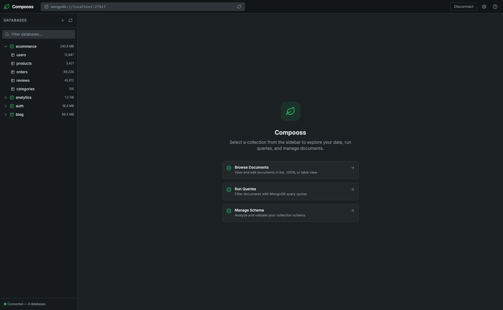

# Compooss

Compooss is a lightweight MongoDB database client designed to run **inside your `docker-compose` stack** during development. The goal is to give you an easy way to explore and manage your MongoDB data **without installing a separate GUI app** on your machine.

**Current release: v1.7.0.**



### Features

- **Docker-first** – Run as a service alongside your app in `docker-compose`.
- **No local install** – Access the UI from your browser, no native app required.
- **MongoDB focused** – Browse databases and collections; view and edit documents with query, filter, sort, and list/JSON/table views.
- **Index management** – Create, drop, hide/unhide, and inspect indexes (unique, compound, text, geospatial, TTL, partial, hashed) with usage statistics.
- **Schema analysis** – Analyze collection schema from sampled documents: view detected fields, type distribution, frequency, value distributions, nested/array structures, and missing or inconsistent fields; refresh on demand.
- **Validation rules** – View, create, and edit collection validation rules using JSON Schema. Set validation level (strict/moderate/off) and action (error/warn). Validate existing documents against the schema and detect violations.
- **Aggregation pipelines** – Build MongoDB aggregations visually with stage templates, drag-and-drop ordering, per-stage previews, text mode editing, result viewer, and the ability to create views from pipelines.
- **MongoDB Shell** – Embedded interactive shell with autocomplete, command history, syntax highlighting, full CRUD, aggregation, index management, database administration, and helper commands (`show dbs`, `use`, `help`).
- **Multiple connections** – Dedicated connection page to save, edit, and switch between MongoDB deployments. Supports authentication (SCRAM, X.509, LDAP, Kerberos), TLS/SSL, advanced options, color-coded profiles, favorites, search, and test-before-connect.
- **Dev-friendly** – Optimized for local development; read-only protection for system databases (`admin`, `local`, `config`).

#### Planned / coming soon

- **Theming support** – System, dark, and light themes with automatic system theme detection.

See [docs/FEATURES.md](docs/FEATURES.md) for the full feature list and planned features.

### Example `docker-compose` usage (conceptual)

```yaml
services:
  mongo:
    image: mongo:latest
    ports:
      - "27017:27017"

  compooss:
    image: compooss/app:latest
    environment:
      - MONGO_URI=mongodb://mongo:27017
    ports:
      - "8080:80"
    depends_on:
      - mongo
```

Then open `http://localhost:8080` in your browser to access Compooss.

### Development

This repository contains the source code for Compooss. During early development, setup and usage may change frequently.

Basic local flow (subject to change):

```sh
git clone <REPO_URL>
cd compooss
npm install
npm run dev
```

### Roadmap

- **v1.0.0 (MVP)** – Shipped: connection, database/collection list and CRUD, document view and CRUD, Docker image.
- **v1.1.0** – Loading skeletons, improved error handling and loading states.
- **v1.2.0** – Full index management: create, drop, hide/unhide indexes; usage stats; all index types (unique, compound, text, geospatial, TTL, partial, hashed).
- **v1.3.0** – Schema analysis: analyze collection schema from samples; view fields, type distribution, frequency, value distributions, nested/array structures; refresh on demand.
- **v1.4.0** – Validation rules: view, create, and edit JSON Schema validators; set validation level and action; validate existing documents and detect violations.
- **v1.5.0** – Aggregation pipelines: visual pipeline builder with stage templates, per-stage previews, saved pipelines, text mode editing, and view creation from pipelines.
- **v1.6.0** – MongoDB Shell: embedded interactive shell with autocomplete, command history, syntax highlighting, full CRUD/aggregation/admin commands, and shell helpers.
- **v1.7.0** – Multiple connections: dedicated connection page with saved profiles, authentication (SCRAM, X.509, LDAP, Kerberos), TLS/SSL, advanced options, color-coded connections, favorites, and disconnect/reconnect from the top bar.
- **Planned**: Improved UX (pagination, query builder); optional auth for shared dev environments; full theming support (system, dark, light).

### Author

- **Name**: Abdullah Mia
- **Project**: Compooss – MongoDB client for `docker-compose`-based development

### Documentation

- [Features & roadmap](docs/FEATURES.md)
- [Contributing](docs/CONTRIBUTING.md)
- [Code of Conduct](docs/CODE_OF_CONDUCT.md)
- [Development Guide](docs/DEVELOPMENT.md)
- [Security Policy](docs/SECURITY.md)
- [Changelog](docs/CHANGELOG.md)

### License

This project is licensed under the **MIT License**. You are free to use, modify, and distribute this software, subject to the terms of the MIT License.
